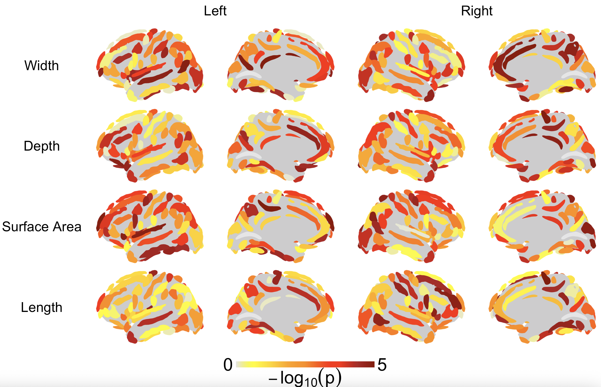

# sulcimap
[](https://doi.org/10.5281/zenodo.17131054)

An R library for mapping cortical folding patterns. This library provides a high-level R function **`plot_sulci()`** to visualize **sulcal measures** based on BrainVISA output and the ENIGMA sulcal protocol.  

It generates publication-ready plots of sulcal statistics/values for **492 sulcal measures**, including:  
- **123 sulci** across the whole brain (62 left, 61 right)  
- **4 sulcal types** per sulcus:  
  - Opening (width) → `.opening`  
  - Depth → `.meandepth_native`  
  - Surface area → `.surface_native`  
  - Length → `.hull_junction_length_native`  

The plots can be generated for each measure separately or all four at once.

**References & links**  
- [BrainVISA](https://brainvisa.info/web/)
- [ENIGMA Imaging Protocols (ENIGMA-Sulci)](https://enigma.ini.usc.edu/protocols/imaging-protocols/)

---

[News](#news) | [Installation](#installation) | [Input Data](#input-data) | [Usage](#Usage) |  [Output Examples](#output-examples) | [License](#license) | [Citation](#citation) |

## News
2025-09-16: sulcimap version 1.0.0 released on GitHub.  
2025-10-06: sulcimap version 1.0.4 released on CRAN and GitHub.

## Installation
You can install this package directly from CRAN:
```r
install.packages("sulcimap")
```

Or install the development version from GitHub:
```r
# install.packages("remotes")
remotes::install_github("mhnshf/sulcimap")
library(sulcimap)
```

## Input Data
The input must be a **CSV file** with **two columns**:

| Sulcus                                | Value |
|---------------------------------------|-------|
| S.C._left.opening                     | 5.31  |
| S.C._left.meandepth_native            | 1.27  |
| S.C._left.surface_native              | 2.42  |
| S.C._left.hull_junction_length_native | 1.96  |
| S.C._right.opening                    | 2.28  |
| ...                                   | ...   |

- `Sulcus`: must contain all **492 sulci name tags** from **BrainVISA ENIGMA output**.  
- The naming convention is: `Sulcus_Hemisphere.MeasureType`  
  **Examples:**
  - `S.C._left.opening`
  - `S.C._right.meandepth_native`
  - `F.I.P._left.surface_native`
  - `F.I.P._right.hull_junction_length_native`

If a sulcus is **not available**, assign the value **0**.  

👉 For the complete list of sulcus name tags and input sample, see [`template_input.csv`](inst/extdata/template_input.csv) and [`input_data_example.csv`](inst/extdata/input_data_example.csv)

## Usage

See documentation for a full example of using `plot_sulci()` function:

```r
plot_out <- plot_sulci(
  sulcus_values = df,
  palette       = "gyr",
  value_range   = NULL,
  save_dir      = "output",
  measure       = "all",
  show_colorbar = TRUE,
  caption       = expression(-log[10](p))
)
```
**Argument details**

- **`sulcus_values`** *(data.frame)*  
  Either (1) a two-column dataframe with `Sulcus` and `Value`, or (2) a path to a CSV file containing those columns.
  `Sulcus` must include all 492 BrainVISA-style tags (left/right × 4 types). Missing types should have `Value = 0`.

- **`palette`** *(character)*  
  The color palette used to map values and colorbar.  
  Common options include `"viridis"`, `"magma"`, `"plasma"`, `"inferno"`, `"cividis"`, `"heat"`, `"gyr"` (grey→yellow→reds) (depending on your implementation). Choose one string.

- **`value_range`** *(numeric length-2 or `NULL`, default `NULL`)*  
  Controls the color scale.  
  - `NULL`: auto-scale from the min/max of provided values.  
  - `c(min, max)`: fix the scale across plots/conditions for comparability.

- **`save_dir`** *(character or `NULL`, default `NULL`)*  
  Directory where the plot image(s) are saved.  
  - If the folder does not exist, it will be created.  
  - Set to `NULL` to skip saving and only return the plot object.

- **`measure`** *(character)*  
  What to plot:  
  - `"all"`: generate all four measures in one go.  
  - `"opening"`, `"depth"`, `"surface"`, `"length"`: generate a single-measure plot.

- **`show_colorbar`** *(logical)*  
  Show or hide the color bar on the figure.

- **`caption`** *(character)*  
  Label displayed under/along the color bar. You can pass a plain string (e.g., `"P-value"`) or an R expression for mathematical notation.


## Output Examples
- **All measures combined** (`measure = "all"`)  


- **Depth** (`measure = "depth"`)  


## License

The *sulcimap* package is a free software, published under the [MIT license](https://opensource.org/licenses/MIT).
See the file [LICENSE](./LICENSE.md) for the full license text.

## Citation

To cite sulcimap in publications use:

> *Mahan Shafie, Fabrizio Pizzagalli (2025). sulcimap: An R library for mapping cortical folding patterns. https://doi.org/10.5281/zenodo.17131054*

A BibTeX entry for LaTeX users is:
```
@Misc{,
   title  = {sulcimap: An {R} library for mapping cortical folding patterns},
   author = {Mahan Shafie and Fabrizio Pizzagalli},
   year   = {2025},
   url    = {https://doi.org/10.5281/zenodo.17131054},
   doi    = {10.5281/zenodo.17131054},
 }
```
## Related R packages

R packages for brain visualization:

* [ggseg](https://github.com/LCBC-UiO/ggseg) by Athanasia Mowinckel and Didac Vidal-Piñeiro: Plotting of atlas-based neuroimaging data in R.

* [fsbrain](https://github.com/dfsp-spirit/fsbrain) by Tim Schäfer: Visualizing  surface-based brain morphometry data in R

## Acknowledgments

- ENIGMA Consortium – sulcal-based morphometry protocol developed by Fabrizio Pizzagalli.  
- BrainVISA – Neuroimaging software platform for sulcal-based morphometry.
- Special thanks to [William Snyder](https://github.com/willsnyder12) for sharing his experience and insights on sulci visualization.

## Author
sulcimap was written by Mahan Shafie/Fabrizio Pizzagalli
